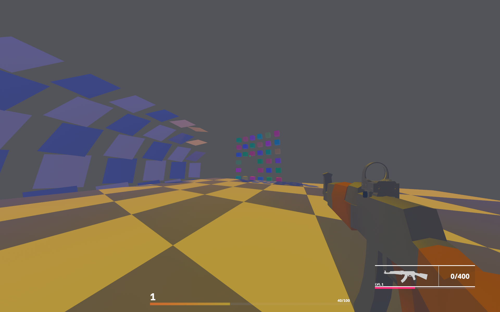

# RusTurok

### A Roguelike first person shooter with incremental damage and buffs
### Inspired from Cookie Clicker, Vampire Survivors, Borderlands and Turok

Current build has:

- Animations
- Smooth transitions between animations
- GLTF Asset loader
- Add/Change attachements to the gun
- XP system
- Hit scan bullets
- Deterministic recoil
- Player movement
  - Crouching
  - Sprinting
  - Jumping
- Simple light
- Simple fog
- Enemy health and death
- HUD
  - Hitmark
  - Damage indicator
  - XP

Tools used:

- Bevy Rust 
- Blender
- Neovim
